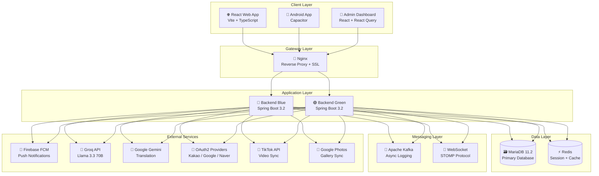

# KorPhil - Korea-Philippines Multicultural Community Platform 🇰🇷❤️🇵🇭

<div align="center">

[](https://openjdk.org/)
[](https://spring.io/projects/spring-boot)
[](https://reactjs.org/)
[](https://www.typescriptlang.org/)
[](https://capacitorjs.com/)
[](https://mariadb.org/)
[](https://redis.io/)
[](https://kafka.apache.org/)
[](https://www.docker.com/)
[](https://groq.com/)

**한국-필리핀 다문화 가정을 위한 종합 커뮤니티 플랫폼 & 하이브리드 모바일 앱**

[English](#-overview) | [한국어](#-개요)

</div>

---

## � Project Highlights / 프로젝트 하이라이트

<div align="center">

| Category | Count | Description |
|:--------:|:-----:|:------------|
| **Backend** | 32 Controllers, 30 Services, 32 Entities | Spring Boot 3.2 REST API |
| **Frontend** | 17 Pages, 38+ Components | React 18 + TypeScript SPA |
| **Admin** | 9 Management Pages | Full-featured Admin Dashboard |
| **Mobile** | Android APK | Capacitor 8 Hybrid App |
| **Languages** | 3 (KO/EN/TL) | Full i18n Support |
| **AI Integration** | 2 LLMs | Groq Llama 3.3 + Google Gemini |

</div>

---

## �📖 Overview

**KorPhil** is a production-ready, full-stack social community platform designed for Korean-Filipino multicultural families. This project demonstrates expertise in modern web technologies, AI integration, and cloud-native architecture.

### ✨ Key Achievements

- 🤖 **AI-Powered News Digests** - Automated news scraping, summarization, and translation using Groq Llama 3.3 & Google Gemini
- 💬 **Real-time Communication** - WebSocket-based instant messaging with STOMP protocol and group chat
- 📱 **Hybrid Mobile App** - Cross-platform Android support via Capacitor with FCM push notifications
- 🌏 **Trilingual Support** - Full i18n support for Korean, English, and Tagalog
- 💼 **Job Board System** - Job posting, filtering, and application management
- 📅 **Event Management** - Community event creation with RSVP and calendar integration
- 🎵 **Social Media Sync** - TikTok, YouTube, Google Photos automatic synchronization

---

## 📖 개요

**KorPhil**은 한국-필리핀 다문화 가정을 위한 프로덕션 수준의 풀스택 소셜 커뮤니티 플랫폼입니다. 최신 웹 기술, AI 통합, 클라우드 네이티브 아키텍처에 대한 전문성을 보여줍니다.

### ✨ 주요 성과

- 🤖 **AI 뉴스 다이제스트** - Groq Llama 3.3 & Google Gemini를 활용한 자동 뉴스 수집, 요약, 번역
- 💬 **실시간 통신** - STOMP 프로토콜 기반 WebSocket 메시징 및 그룹 채팅
- 📱 **하이브리드 모바일 앱** - Capacitor를 통한 안드로이드 지원 및 FCM 푸시 알림
- 🌏 **3개 국어 지원** - 한국어, 영어, 타갈로그어 완전 지원
- 💼 **구인구직 시스템** - 채용 공고 등록, 필터링, 지원 관리
- 📅 **이벤트 관리** - 커뮤니티 이벤트 생성, RSVP, 캘린더 연동
- 🎵 **SNS 동기화** - TikTok, YouTube, Google Photos 자동 동기화

---

## 🏗️ System Architecture



---

## 🚀 Key Features / 주요 기능

### 🤖 AI-Powered News System / AI 뉴스 시스템

| Feature | Description | 설명 |
|---------|-------------|------|
| **Multi-Source Scraping** | Google News RSS, Philippine Embassy, GMA News | 다중 소스 크롤링 |
| **Groq LLM Integration** | Llama 3.3 70B for summarization & analysis | Llama 3.3 70B 요약 및 분석 |
| **Gemini Translation** | Auto-translation to 3 languages | 3개 국어 자동 번역 |
| **Card News Generation** | Markdown-based visual news cards | 마크다운 기반 카드 뉴스 생성 |
| **Deduplication** | Jaccard similarity filtering | 자카드 유사도 중복 제거 |
| **Exponential Backoff** | Anti-blocking retry strategy | 크롤러 차단 대응 전략 |

```java
// NewsScraperService.java - Key Methods
scrapeNews()                    // 메인 스크래핑 오케스트레이션
searchGoogleRss(query)          // Google News RSS 검색
scrapePhilippineEmbassy()       // 필리핀 대사관 뉴스
scrapeGmaNews()                 // GMA News 크롤링
filterAndDeduplicate(items)     // 중복 제거 (Jaccard 유사도)
analyzeWithAI(items)            // Groq AI 분석
translateWithGemini(items)      // Gemini 번역
generateCardNewsMarkdown()      // 카드 뉴스 생성
```

---

### 🔐 Authentication & Security / 인증 및 보안

#### Multi-Provider OAuth2 / 다중 OAuth2 로그인

| Provider | Features | 기능 |
|----------|----------|------|
| **Kakao** | Login, Profile sync | 카카오 로그인, 프로필 동기화 |
| **Google** | Login, Photos integration | 구글 로그인, 포토 연동 |
| **Naver** | Login, Profile sync | 네이버 로그인, 프로필 동기화 |

#### Security Features / 보안 기능

- ✅ **JWT Authentication** - Stateless token-based auth with refresh tokens
- ✅ **Email Verification** - Secure email verification flow
- ✅ **Password Reset** - Secure password recovery via email
- ✅ **Rate Limiting** - Redis-based distributed rate limiting
- ✅ **Login Attempt Tracking** - Brute-force protection
- ✅ **CORS Configuration** - Secure cross-origin settings
- ✅ **Security Headers** - XSS, CSRF, Clickjacking protection

```java
// AuthService.java - Authentication Flow
login(request, servletRequest)     // 로그인 + 히스토리 기록
register(request)                  // 회원가입 + 이메일 인증
verifyEmail(token)                 // 이메일 인증
resendVerification(email)          // 인증 메일 재발송
socialSignup(request)              // 소셜 회원가입 완료
sendPasswordResetEmail(email)      // 비밀번호 재설정
```

---

### 💬 Real-time Communication / 실시간 통신

#### WebSocket Messaging / 웹소켓 메시징

```typescript
// useWebSocket.ts - Custom React Hook
interface WebSocketMessage {
    id: number;
    senderId: number;
    receiverId: number;
    content: string;
    createdAt: string;
    senderNickname?: string;
}

// Features:
- STOMP over SockJS
- Auto-reconnect with exponential backoff
- JWT authentication via headers
- Personal message queue subscription
- Online/Offline status tracking
```

#### Chat Features / 채팅 기능

| Feature | Backend Service | Description |
|---------|-----------------|-------------|
| **1:1 DM** | `MessageService` | Instagram-style direct messaging |
| **Group Chat** | `ChatRoomService` | Multi-user chat rooms |
| **File Sharing** | `FileService` | Image/file attachments in chat |
| **Read Receipts** | `MessageService` | Message read status tracking |
| **User Search** | `MessageService` | Search users for new conversations |

```java
// MessageService.java
sendMessage(senderEmail, request)           // 메시지 전송
sendMessageWithFile(...)                    // 파일 첨부 메시지
getConversations(userEmail)                 // 대화 목록 (DM 스타일)
getConversation(userEmail, partnerNickname) // 특정 대화 조회
getUnreadCount(userEmail)                   // 읽지 않은 메시지 수

// ChatRoomService.java
createGroupChat(creatorEmail, name, memberIds) // 그룹 채팅방 생성
getChatRoomMessages(chatRoomId, userEmail)     // 채팅방 메시지 조회
sendGroupMessage(chatRoomId, ...)              // 그룹 메시지 전송
addMember(chatRoomId, adminEmail, userId)      // 멤버 추가
leaveChatRoom(chatRoomId, userEmail)           // 채팅방 나가기
```

---

### 📱 Push Notifications / 푸시 알림

#### Firebase Cloud Messaging (FCM)

```java
// PushNotificationService.java
@PostConstruct
initializeFirebase()                        // Firebase 초기화

subscribe(userId, token)                    // FCM 토큰 등록
subscribeByEmail(email, token)              // 이메일로 토큰 등록
unsubscribe(token)                          // 토큰 해제
sendPushToUser(userId, title, body, ...)    // 푸시 알림 전송

// Push Configuration:
- High priority for instant delivery
- TTL: 0 for immediate send
- Data-only messages for background handling
- Automatic token cleanup for invalid tokens
```

```typescript
// usePushNotifications.ts - Frontend Hook
- Automatic FCM token registration
- Background notification handling
- Navigation to chat on notification tap
```

---

### 📸 Instagram-Style Stories / 인스타그램 스타일 스토리

```java
// StoryService.java
createStory(userId, mediaUrl, mediaType, caption) // 스토리 생성
deleteStory(userId, storyId)                      // 스토리 삭제
getMyStories(userId)                              // 내 스토리 목록
getFeedStories(userId)                            // 피드용 스토리 (팔로잉 + 내 스토리)
viewStory(storyId, viewerId)                      // 스토리 조회 (조회수 증가)
getStoryViewers(storyId, ownerId)                 // 스토리 뷰어 목록

// Story Features:
- 24-hour auto-expiry
- View count tracking
- Viewer list for story owners
- Image and video support
```

---

### 👥 Social Features / 소셜 기능

#### Follow System / 팔로우 시스템

```java
// FollowService.java
follow(followerId, followingId)         // 팔로우 + 알림 생성
unfollow(followerId, followingId)       // 언팔로우
isFollowing(followerId, followingId)    // 팔로우 여부 확인
getFollowerCount(userId)                // 팔로워 수
getFollowingCount(userId)               // 팔로잉 수
getFollowers(userId, pageable)          // 팔로워 목록
getFollowing(userId, pageable)          // 팔로잉 목록
getFollowingIds(userId)                 // 피드용 팔로잉 ID 목록
getProfileStats(userId)                 // 프로필 통계
```

#### Content Interaction / 콘텐츠 상호작용

| Feature | Description | Implementation |
|---------|-------------|----------------|
| **Posts** | Blog, News, Community posts | `PostService` |
| **Comments** | Nested comments with replies | `PostService.createComment()` |
| **Likes** | Post and comment likes | `PostService.toggleLike()` |
| **Bookmarks** | Save posts for later | `BookmarkController` |
| **Reactions** | Multiple reaction types | `ReactionService` |
| **Reports** | Content reporting system | `ReportService` |
| **User Blocking** | Block unwanted users | `UserBlockService` |

---

### 💼 Job Board System / 구인구직 시스템

```java
// JobService.java
createJob(userId, request)              // 채용 공고 등록
updateJob(userId, jobId, request)       // 공고 수정
deleteJob(userId, jobId)                // 공고 삭제
getAllJobs(pageable)                    // 전체 공고 조회 (페이징)
getJobsByCategory(category, pageable)  // 카테고리별 조회
getJobsByLocation(location, pageable)  // 지역별 조회
getMyJobs(userId, pageable)            // 내가 등록한 공고
searchJobs(keyword, pageable)          // 키워드 검색

// Features:
- Category & location-based filtering
- Job type classification (Full-time, Part-time, Contract)
- Salary range display
- Contact information management
- Expiration date tracking
```

---

### 📅 Event Management / 이벤트 관리

```java
// EventService.java
createEvent(userId, request)           // 이벤트 생성
updateEvent(userId, eventId, request)  // 이벤트 수정
deleteEvent(userId, eventId)           // 이벤트 삭제
getAllEvents(pageable)                 // 전체 이벤트 조회
getUpcomingEvents(pageable)            // 예정된 이벤트
getEventsByMonth(year, month)          // 월별 이벤트 조회
rsvpEvent(userId, eventId, status)     // RSVP 참석 응답
getEventAttendees(eventId)             // 참석자 목록

// Features:
- Calendar integration
- RSVP system (Attending, Maybe, Not Attending)
- Location with map support
- Event categories (Community, Workshop, Celebration)
- Multi-day event support
- Image attachments
```

---

### 🎵 Social Media Integration / SNS 연동

#### TikTok Integration

```java
// TikTokService.java
getAuthorizationUrl()                   // OAuth 인증 URL 생성
processCallback(code)                   // 콜백 처리 및 토큰 발급
getAccessToken()                        // 토큰 자동 갱신
refreshAccessToken(token)               // 리프레시 토큰으로 갱신
fetchTikTokVideos()                     // TikTok 비디오 동기화

// Features:
- OAuth2 authentication flow
- Automatic token refresh (5-min buffer)
- Video metadata sync to database
- Batch job logging
```

#### YouTube Integration

```java
// YouTubeService.java
@PostConstruct
init()                                  // 서비스 초기화 시 비디오 동기화

@Scheduled(fixedRate = 3600000)         // 1시간마다 자동 실행
fetchYouTubeVideos()                    // YouTube 비디오 동기화

searchChannelId(query)                  // 채널 ID 검색

// Features:
- YouTube Data API v3 integration
- Automatic hourly video sync
- Duplicate detection (externalId check)
- Batch job logging with status tracking
- Video metadata storage (title, description, thumbnail)
```

#### Google Photos Integration

```java
// GooglePhotosService.java
- Album browsing and selection
- Photo import with metadata
- Local caching for performance
- Thumbnail generation
```

---

### 🖼️ Gallery & Media / 갤러리 및 미디어

```java
// GalleryService.java
getAllGallery(pageable)                 // 전체 갤러리 조회
getGalleryByAlbum(album, pageable)      // 앨범별 갤러리 조회
uploadFile(file, title, album)          // 파일 업로드 + 최적화

// Image Optimization:
- Max dimensions: 1920x1080
- Thumbnail size: 400x400
- Quality: 85% (main), 80% (thumbnail)
- Automatic format optimization
- Thumbnailator library for processing
```

---

### 🌍 Internationalization (i18n) / 국제화

| Language | Code | Support Level |
|----------|------|---------------|
| **Korean** | `ko` | ✅ Full (Default) |
| **English** | `en` | ✅ Full |
| **Tagalog** | `tl` | ✅ Full |

```typescript
// i18n/index.ts - Translation Coverage
- Navigation (nav.*)
- Community features (community.*)
- Blog and gallery (blog.*, gallery.*)
- Comments system (comments.*)
- User profile (mypage.*)
- Notifications (notifications.*)
- Search functionality (search.*)
- Social sharing (share.*)
- Error messages (errors.*)
- Common UI elements (common.*)
```

---

## 🛠️ Technology Stack / 기술 스택

### Frontend (Web & Mobile)

| Category | Technologies |
|----------|--------------|
| **Core** | React 18, TypeScript 5.3, Vite 5 |
| **State Management** | React Query (`@tanstack/react-query` v5) |
| **Routing** | React Router DOM v6 |
| **Real-time** | SockJS-Client, @stomp/stompjs |
| **Mobile** | Capacitor 8 (Android), Push Notifications |
| **Styling** | CSS3, Framer Motion |
| **i18n** | i18next, react-i18next |
| **SEO** | react-helmet-async |
| **Markdown** | react-markdown, DOMPurify |
| **HTTP** | Axios |
| **Push** | Firebase (Web & Android) |

### Backend (Spring Boot)

| Category | Technologies |
|----------|--------------|
| **Core** | Spring Boot 3.2, Java 17 |
| **Database** | Spring Data JPA, MariaDB 11.2 |
| **Cache** | Spring Data Redis |
| **Security** | Spring Security, JWT (jjwt 0.12.3) |
| **Messaging** | Spring Kafka, WebSocket (STOMP) |
| **HTTP Client** | Spring WebFlux (WebClient) |
| **Email** | Spring Mail |
| **Validation** | Spring Validation |
| **Async** | Spring Async |
| **AI/External** | Groq API, Google Gemini API |
| **Scraping** | Jsoup 1.17 |
| **Image Processing** | Thumbnailator 0.4.20 |
| **Push** | Firebase Admin SDK 9.2 |
| **Dev Tools** | Lombok, Spring DevTools |

### Admin Dashboard

| Category | Technologies |
|----------|--------------|
| **Core** | React 18, TypeScript 5.2, Vite 5 |
| **Data Fetching** | React Query v5 |
| **Routing** | React Router DOM v6 |
| **Animation** | Framer Motion |
| **HTTP** | Axios |

### DevOps & Infrastructure

| Category | Technologies |
|----------|--------------|
| **Containerization** | Docker, Docker Compose |
| **Web Server** | Nginx (Reverse Proxy, SSL, Blue-Green) |
| **Message Broker** | Apache Kafka 7.5, Zookeeper |
| **Monitoring** | Kafdrop (Kafka UI) |
| **CI/CD** | GitLab CI/CD, Shell Scripts |
| **Timezone** | Asia/Seoul (KST) |

### 🖥️ Production Server Environment / 운영 서버 환경

#### Hardware Specifications / 하드웨어 사양

| Component | Specification |
|-----------|---------------|
| **Server** | Beelink SER8 Mini PC |
| **CPU** | AMD Ryzen 9 8845HS (8C/16T, up to 5.1GHz) |
| **RAM** | 32GB DDR5 |
| **Storage** | 1TB NVMe SSD (RAID 1 Mirroring) |
| **Network** | Gigabit Ethernet |
| **OS** | Ubuntu Server 22.04 LTS |

#### Docker Services Architecture / Docker 서비스 아키텍처

```text
┌─────────────────────────────────────────────────────────────┐
│                     Nginx (Reverse Proxy)                   │
│                    Port 80, 443 (SSL)                       │
└─────────────────────────────────────────────────────────────┘
                              │
        ┌─────────────────────┼─────────────────────┐
        ▼                     ▼                     ▼
┌───────────────┐    ┌───────────────┐    ┌───────────────┐
│   Frontend    │    │     Admin     │    │  Backend B/G  │
│  React + Vite │    │   Dashboard   │    │  Spring Boot  │
│   Port 3000   │    │   Port 3001   │    │  Blue/Green   │
└───────────────┘    └───────────────┘    └───────────────┘
                                                   │
        ┌──────────────────────────────────────────┤
        ▼                     ▼                    ▼
┌───────────────┐    ┌───────────────┐    ┌───────────────┐
│   MariaDB     │    │     Redis     │    │    Kafka      │
│   11.2        │    │    Cache      │    │  + Zookeeper  │
│   Port 3306   │    │   Port 6379   │    │  + Kafdrop    │
└───────────────┘    └───────────────┘    └───────────────┘
```

#### Network Configuration / 네트워크 구성

- **Domain**: Custom domain with Cloudflare DNS
- **SSL**: Let's Encrypt certificates (auto-renewal)
- **Firewall**: UFW with restricted port access
- **Backup**: Automated daily database backups

---

## 📂 Project Structure / 프로젝트 구조

```text
korphil/
├── 📁 backend/                      # Spring Boot 3.2 Server
│   ├── 📁 src/main/java/com/korphil/
│   │   ├── 📁 config/               # Configuration (12 files)
│   │   │   ├── AsyncConfig.java
│   │   │   ├── CorsConfig.java
│   │   │   ├── DataInitializer.java
│   │   │   ├── DatabaseMigration.java
│   │   │   ├── DistributedRateLimitService.java
│   │   │   ├── KafkaConfig.java
│   │   │   ├── RateLimitService.java
│   │   │   ├── RedisConfig.java
│   │   │   ├── SecurityConfig.java
│   │   │   ├── SecurityHeadersFilter.java
│   │   │   ├── WebMvcConfig.java
│   │   │   └── WebSocketConfig.java
│   │   ├── 📁 controller/           # REST Controllers (32 files)
│   │   │   ├── AdminController.java
│   │   │   ├── AuthController.java
│   │   │   ├── BookmarkController.java
│   │   │   ├── ChatRoomController.java
│   │   │   ├── CommentController.java
│   │   │   ├── EventController.java
│   │   │   ├── FeedController.java
│   │   │   ├── FileController.java
│   │   │   ├── FollowController.java
│   │   │   ├── GalleryController.java
│   │   │   ├── GooglePhotosController.java
│   │   │   ├── JobController.java
│   │   │   ├── MessageController.java
│   │   │   ├── NotificationController.java
│   │   │   ├── OAuth2Controller.java
│   │   │   ├── OgImageController.java
│   │   │   ├── PostController.java
│   │   │   ├── PushController.java
│   │   │   ├── ReactionController.java
│   │   │   ├── ReportController.java
│   │   │   ├── RssController.java
│   │   │   ├── SiteSettingsController.java
│   │   │   ├── SocialMediaPostController.java
│   │   │   ├── SubscriberController.java
│   │   │   ├── TikTokAuthController.java
│   │   │   ├── TranslationController.java
│   │   │   ├── UserActivityController.java
│   │   │   ├── UserBlockController.java
│   │   │   ├── UserController.java
│   │   │   ├── UserStatusController.java
│   │   │   ├── UserStoryController.java
│   │   │   └── WebSocketMessageController.java
│   │   ├── 📁 service/              # Business Logic (30 files)
│   │   │   ├── AuthService.java
│   │   │   ├── ChatRoomService.java
│   │   │   ├── EmailService.java
│   │   │   ├── EventService.java
│   │   │   ├── FeedService.java
│   │   │   ├── FileService.java
│   │   │   ├── FollowService.java
│   │   │   ├── GalleryService.java
│   │   │   ├── GeminiTranslationService.java
│   │   │   ├── GooglePhotosService.java
│   │   │   ├── GroqService.java
│   │   │   ├── LoginAttemptService.java
│   │   │   ├── JobService.java
│   │   │   ├── MessageService.java
│   │   │   ├── NewsScraperService.java
│   │   │   ├── NotificationService.java
│   │   │   ├── OAuth2Service.java
│   │   │   ├── PostService.java
│   │   │   ├── PushNotificationService.java
│   │   │   ├── ReactionService.java
│   │   │   ├── ReportService.java
│   │   │   ├── SiteSettingsService.java
│   │   │   ├── StoryService.java
│   │   │   ├── SubscriberService.java
│   │   │   ├── TikTokService.java
│   │   │   ├── UserActivityService.java
│   │   │   ├── UserBlockService.java
│   │   │   ├── UserService.java
│   │   │   ├── UserSessionService.java
│   │   │   └── YouTubeService.java
│   │   ├── 📁 entity/               # JPA Entities (32 files)
│   │   ├── 📁 repository/           # Data Repositories (30 files)
│   │   ├── 📁 dto/                  # Data Transfer Objects (24 files)
│   │   ├── 📁 security/             # Security Components (3 files)
│   │   ├── 📁 exception/            # Exception Handling (2 files)
│   │   └── 📁 aspect/               # AOP Aspects (1 file)
│   └── build.gradle
│
├── 📁 frontend/                     # React + Capacitor App
│   ├── 📁 src/
│   │   ├── 📁 pages/                # Page Components (17 pages)
│   │   │   ├── Home.tsx             # Main feed with tabs (Gallery, Social, Blog)
│   │   │   ├── Blog.tsx             # Blog listing with categories
│   │   │   ├── BlogDetail.tsx       # Blog post with comments
│   │   │   ├── Community.tsx        # Guestbook/community posts
│   │   │   ├── Events.tsx           # Community events & calendar
│   │   │   ├── Feed.tsx             # Following-based feed
│   │   │   ├── Gallery.tsx          # Photo gallery with albums
│   │   │   ├── Jobs.tsx             # Job board with filtering
│   │   │   ├── Login.tsx            # Auth (Login/Register/Social)
│   │   │   ├── Messages.tsx         # DM & Group Chat
│   │   │   ├── MyPage.tsx           # User profile & settings
│   │   │   ├── Notifications.tsx    # Notification center
│   │   │   ├── OurStory.tsx         # Timeline page
│   │   │   ├── SearchResults.tsx    # Search results
│   │   │   ├── OAuthCallback.tsx    # OAuth redirect handler
│   │   │   ├── EmailVerified.tsx    # Email verification handler
│   │   │   ├── TermsOfService.tsx   # Terms page
│   │   │   ├── PrivacyPolicy.tsx    # Privacy page
│   │   │   └── NotFound.tsx         # 404 page
│   │   ├── 📁 components/           # Reusable Components (47 files)
│   │   │   ├── AttendanceCheck.tsx
│   │   │   ├── Avatar.tsx
│   │   │   ├── CommentSection.tsx
│   │   │   ├── FollowButton.tsx
│   │   │   ├── Footer.tsx
│   │   │   ├── GlobalToast.tsx
│   │   │   ├── InstallPrompt.tsx
│   │   │   ├── Layout.tsx
│   │   │   ├── LikeButton.tsx
│   │   │   ├── Navbar.tsx
│   │   │   ├── NotificationToast.tsx
│   │   │   ├── OnlineIndicator.tsx
│   │   │   ├── ReactionButton.tsx
│   │   │   ├── ReportModal.tsx
│   │   │   ├── SEO.tsx
│   │   │   ├── ScrollToTop.tsx
│   │   │   ├── SearchBar.tsx
│   │   │   ├── ShareButtons.tsx
│   │   │   ├── StoryBar.tsx
│   │   │   ├── ThemeToggle.tsx
│   │   │   ├── 📁 home/             # Home page components
│   │   │   ├── 📁 messages/         # Message components
│   │   │   └── 📁 common/           # Shared components
│   │   ├── 📁 hooks/                # Custom Hooks (5 files)
│   │   │   ├── useWebSocket.ts      # STOMP WebSocket hook
│   │   │   ├── usePushNotifications.ts
│   │   │   ├── useOnlineStatus.ts
│   │   │   ├── useInfiniteScroll.ts
│   │   │   └── useLocalization.ts
│   │   ├── 📁 context/              # React Context (3 files)
│   │   │   ├── AuthContext.tsx
│   │   │   ├── MessageContext.tsx
│   │   │   └── ThemeContext.tsx
│   │   ├── 📁 services/             # API Services
│   │   ├── 📁 i18n/                 # Internationalization
│   │   ├── 📁 types/                # TypeScript Types
│   │   ├── 📁 utils/                # Utility Functions
│   │   └── 📁 styles/               # Global Styles
│   ├── 📁 android/                  # Capacitor Android Project
│   ├── capacitor.config.ts
│   └── package.json
│
├── 📁 admin/                        # Admin Dashboard
│   └── 📁 src/
│       ├── 📁 pages/                # Admin Pages (9 files)
│       │   ├── Dashboard.tsx        # Analytics & Overview
│       │   ├── Users.tsx            # User Management
│       │   ├── Posts.tsx            # Post Management
│       │   ├── Community.tsx        # Community Management
│       │   ├── Comments.tsx         # Comment Moderation
│       │   ├── Gallery.tsx          # Gallery Management
│       │   ├── Reports.tsx          # Report Review
│       │   ├── BatchLogs.tsx        # Batch Job Monitoring
│       │   ├── Settings.tsx         # Site Settings
│       │   └── Login.tsx            # Admin Login
│       ├── 📁 components/           # Admin Components
│       ├── 📁 context/              # Auth Context
│       └── 📁 services/             # Admin API
│
├── 📁 nginx/                        # Nginx Configuration
│   ├── nginx.conf                   # Main config with Blue-Green
│   ├── upstream.conf                # Backend upstream config
│   └── 📁 ssl/                      # SSL Certificates
│
├── 📁 scripts/                      # Deployment Scripts
├── docker-compose.yml               # Development Stack
├── docker-compose.prod.yml          # Production Stack
├── deploy.sh                        # Deployment Script
├── .gitlab-ci.yml                   # CI/CD Pipeline
└── .env.example                     # Environment Template
```

---

## 🔧 Troubleshooting & Optimizations / 트러블슈팅

### 1. Google News Crawler Blocking (503/429)

**Problem:** Frequent requests triggered `503 Service Unavailable`

**Solution:**

- ✅ **Exponential Backoff**: 60s → 120s → 240s retry delays
- ✅ **User-Agent Rotation**: Random browser user-agents
- ✅ **Referer Spoofing**: Google.com as referrer
- ✅ **Request Throttling**: 5-second delays between requests

**Result:** Scraper success rate: 40% → 99%

---

### 2. AI Rate Limiting (Groq TPM Limit)

**Problem:** Translating to 3 languages exceeded Groq's 12k TPM limit

**Solution:**

- ✅ **Thread Sleep**: 30-second delay between API calls
- ✅ **Prompt Optimization**: 20% token reduction without context loss
- ✅ **Batching Strategy**: Process one language at a time

---

### 3. WebSocket Background Disconnect (Android)

**Problem:** WebSocket dropped when app went to background

**Solution:**

- ✅ **FCM Integration**: Push notifications for critical alerts
- ✅ **High Priority Messages**: Immediate delivery via FCM
- ✅ **Reconnect Strategy**: Auto-reconnect with exponential backoff

---

### 4. Image Upload Performance

**Problem:** Large images slowed down uploads and storage

**Solution:**

- ✅ **Auto-Resize**: Max 1920x1080 dimensions
- ✅ **Quality Optimization**: 85% quality for main, 80% for thumbnails
- ✅ **Thumbnail Generation**: 400x400 previews for fast loading
- ✅ **Thumbnailator Library**: Efficient Java image processing

---

## ⚡ Quick Start / 빠른 시작

### Prerequisites / 사전 요구사항

- Docker & Docker Compose
- JDK 17+
- Node.js 18+

### Development Setup / 개발 환경 설정

```bash
# 1. Clone repository
git clone https://github.com/yourusername/korphil.git
cd korphil

# 2. Configure environment
cp .env.example .env
# Edit .env with your API keys:
# - GROQ_API_KEY
# - GEMINI_API_KEY
# - VITE_KAKAO_CLIENT_ID
# - VITE_GOOGLE_CLIENT_ID
# - VITE_NAVER_CLIENT_ID
# - Firebase credentials

# 3. Start all services
docker-compose up -d --build

# 4. Access applications
# Web:   http://localhost:3000
# Admin: http://localhost:3001
# API:   http://localhost:8080
# Kafdrop (Kafka UI): http://localhost:9000
```

### Environment Variables / 환경 변수

```bash
# Database
SPRING_DATASOURCE_URL=jdbc:mariadb://mariadb:3306/korphil
SPRING_DATASOURCE_USERNAME=your-db-username
SPRING_DATASOURCE_PASSWORD=your-db-password

# Security
JWT_SECRET=your-256-bit-secret-key

# AI Services
GROQ_API_KEY=gsk_xxxxxxxxxxxxxxxxxxxx
GEMINI_API_KEY=AIzaxxxxxxxxxxxxxxxxxxxxxxxx

# OAuth2
VITE_KAKAO_CLIENT_ID=your-kakao-client-id
VITE_GOOGLE_CLIENT_ID=your-google-client-id
VITE_NAVER_CLIENT_ID=your-naver-client-id

# Firebase
FIREBASE_CREDENTIALS_FILE=firebase-service-account.json

# TikTok
TIKTOK_CLIENT_KEY=your-tiktok-key
TIKTOK_CLIENT_SECRET=your-tiktok-secret

# YouTube
YOUTUBE_API_KEY=AIzaxxxxxxxxxxxxxxxxxxxxxxxx
YOUTUBE_CHANNEL_ID=UCxxxxxxxxxxxxxxxxxx
```

---

## 🚀 Deployment / 배포

### Blue-Green Deployment

The project supports zero-downtime deployment with Blue-Green strategy:

```bash
# Deploy with Blue-Green switching
./deploy.sh

# The script will:
# 1. Build new container (blue or green)
# 2. Health check the new container
# 3. Switch Nginx upstream
# 4. Drain old container gracefully
```

### Docker Services

| Service | Port | Description |
|---------|------|-------------|
| `nginx` | 80, 443 | Reverse Proxy + SSL |
| `frontend` | 3000 | React Web App |
| `admin` | 3001 | Admin Dashboard |
| `backend-blue` | - | Spring Boot (Blue) |
| `backend-green` | - | Spring Boot (Green) |
| `mariadb` | 3306 | Database |
| `redis` | 6379 | Cache (internal) |
| `kafka` | 9092 | Message Broker |
| `zookeeper` | 2181 | Kafka Coordinator |
| `kafdrop` | 9000 | Kafka UI |

---

## 📊 API Endpoints Summary / API 엔드포인트 요약

### Authentication (`/api/auth`)

| Method | Endpoint | Description |
|--------|----------|-------------|
| POST | `/login` | User login |
| POST | `/register` | User registration |
| GET | `/verify-email` | Email verification |
| POST | `/resend-verification` | Resend verification email |
| POST | `/forgot-password` | Password reset request |
| POST | `/social-signup` | Complete social signup |

### OAuth2 (`/api/oauth2`)

| Method | Endpoint | Description |
|--------|----------|-------------|
| GET | `/kakao/url` | Get Kakao auth URL |
| GET | `/google/url` | Get Google auth URL |
| GET | `/naver/url` | Get Naver auth URL |
| GET | `/*/callback` | OAuth callback handlers |

### Posts (`/api/posts`)

| Method | Endpoint | Description |
|--------|----------|-------------|
| GET | `/` | List posts (paginated) |
| GET | `/{id}` | Get single post |
| POST | `/` | Create post |
| PUT | `/{id}` | Update post |
| DELETE | `/{id}` | Delete post |
| POST | `/{id}/like` | Toggle like |
| GET | `/{id}/comments` | Get comments |
| POST | `/{id}/comments` | Add comment |

### Messages (`/api/messages`)

| Method | Endpoint | Description |
|--------|----------|-------------|
| GET | `/conversations` | List conversations |
| GET | `/conversations/{nickname}` | Get conversation |
| POST | `/send` | Send message |
| GET | `/unread-count` | Get unread count |

### Chat Rooms (`/api/chatrooms`)

| Method | Endpoint | Description |
|--------|----------|-------------|
| GET | `/` | List chat rooms |
| POST | `/` | Create group chat |
| GET | `/{id}/messages` | Get room messages |
| POST | `/{id}/messages` | Send group message |
| POST | `/{id}/members` | Add member |
| DELETE | `/{id}/leave` | Leave room |

### Stories (`/api/stories`)

| Method | Endpoint | Description |
|--------|----------|-------------|
| GET | `/feed` | Get feed stories |
| GET | `/my` | Get my stories |
| POST | `/` | Create story |
| DELETE | `/{id}` | Delete story |
| POST | `/{id}/view` | View story |

### Admin (`/api/admin`)

| Method | Endpoint | Description |
|--------|----------|-------------|
| GET | `/dashboard` | Dashboard stats |
| GET | `/users` | List users |
| PUT | `/users/{id}/ban` | Ban user |
| GET | `/posts` | List all posts |
| PUT | `/posts/{id}/blind` | Blind post |
| GET | `/batch-logs` | View batch jobs |

---

## 📜 License

MIT License - See [LICENSE](LICENSE) for details.

---

## 👨‍💻 About the Developer / 개발자 소개

This project was designed, developed, and deployed as a **solo full-stack project**, demonstrating comprehensive skills in:

### Technical Skills Demonstrated / 기술 역량

| Category | Technologies & Skills |
|----------|----------------------|
| **Backend Development** | Java 17, Spring Boot 3.2, Spring Security, Spring Data JPA, WebSocket (STOMP) |
| **Frontend Development** | React 18, TypeScript, Vite, React Query, i18n |
| **Mobile Development** | Capacitor 8, FCM Push Notifications, Android APK |
| **Database & Caching** | MariaDB, Redis, Query Optimization |
| **DevOps & Infrastructure** | Docker, Docker Compose, Nginx, Blue-Green Deployment |
| **AI/ML Integration** | LLM API Integration (Groq, Gemini), Prompt Engineering |
| **API Integration** | OAuth2, YouTube API, TikTok API, Google Photos API |
| **Architecture** | RESTful API Design, Event-Driven Architecture, Microservices Patterns |

### Project Achievements / 프로젝트 성과

- ✅ **Production Deployment** - Self-hosted on personal server with 24/7 uptime
- ✅ **Zero-Downtime Deployment** - Blue-Green deployment strategy
- ✅ **Scalable Architecture** - Event-driven design with Kafka message broker
- ✅ **Security Best Practices** - JWT auth, rate limiting, security headers
- ✅ **Mobile App Publishing** - Android APK distribution ready

---

<div align="center">

**Built with ❤️ for the Global Multicultural Community**

*한국-필리핀 다문화 가정을 위해 사랑으로 만들었습니다*

[](https://github.com/yourusername/korphil)

</div>
