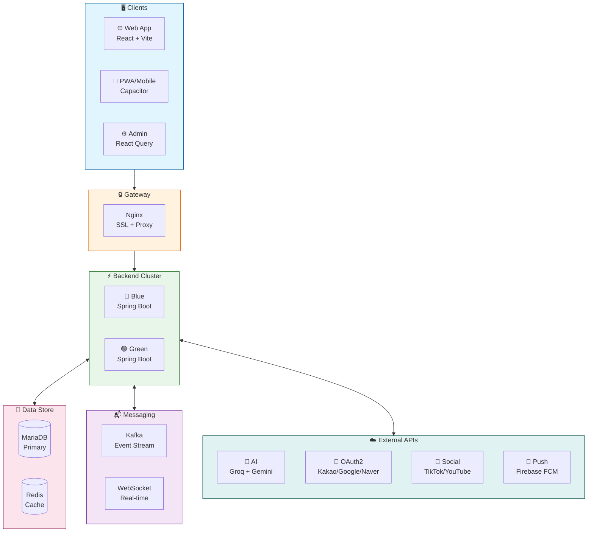

# KorPhil - Korea-Philippines Multicultural Community Platform 🇰🇷❤️🇵🇭

<div align="center">

[](https://korphil.com)
[](https://korphil.com)

[](https://openjdk.org/)
[](https://spring.io/projects/spring-boot)
[](https://reactjs.org/)
[](https://www.typescriptlang.org/)
[](https://mariadb.org/)
[](https://redis.io/)
[](https://kafka.apache.org/)
[](https://www.docker.com/)

**한국-필리핀 다문화 가정을 위한 종합 커뮤니티 플랫폼**

</div>

---

## 👨‍💻 About the Developer

This project was designed, developed, and deployed as a **solo full-stack project**.

### Technical Skills

| Category | Technologies |
|----------|-------------|
| **Backend** | Java 17, Spring Boot 3.2, Spring Security, JPA, WebSocket (STOMP) |
| **Frontend** | React 18, TypeScript, Vite, React Query, i18n |
| **Mobile** | Capacitor 8, FCM Push Notifications, PWA |
| **Database** | MariaDB, Redis, Query Optimization |
| **DevOps** | Docker, Nginx, Blue-Green Deployment, CI/CD |
| **AI** | Groq Llama 3.3, Google Gemini, Prompt Engineering |
| **API** | OAuth2, YouTube API, TikTok API, Google Photos API |

### Achievements

- ✅ **Production Deployment** - Self-hosted server with 24/7 uptime
- ✅ **Zero-Downtime** - Blue-Green deployment strategy
- ✅ **Scalable Architecture** - Event-driven with Kafka
- ✅ **Security** - JWT, rate limiting, security headers
- ✅ **Mobile Ready** - PWA + Android APK

---

## 📊 Project Scale

| Category | Count | Description |
|:--------:|:-----:|:------------|
| **Backend** | 32 Controllers, 30 Services, 32 Entities | Spring Boot REST API |
| **Frontend** | 17 Pages, 38+ Components | React + TypeScript SPA |
| **Admin** | 9 Management Pages | Full-featured Dashboard |
| **Languages** | 3 (KO/EN/TL) | Trilingual i18n Support |
| **AI** | 2 LLMs | Groq Llama 3.3 + Google Gemini |

---

## 🏗️ System Architecture



---

## ✨ Key Features

### 🤖 AI-Powered News System

- Multi-source scraping (Google News, Philippine Embassy, GMA News)
- Groq Llama 3.3 70B for summarization
- Google Gemini for translation
- Automatic card news generation

### 💬 Real-time Communication

- WebSocket STOMP protocol
- 1:1 and group chat
- Read receipts and typing indicators
- FCM push notifications

### 🔐 Authentication & Security

- Multi-provider OAuth2 (Kakao, Google, Naver)
- JWT with refresh token rotation
- Rate limiting per IP/User
- XSS, CSRF protection

### 🎵 Social Media Integration

- TikTok video synchronization
- YouTube channel sync
- Google Photos gallery integration

### 💼 Community Features

- Job board with filtering
- Event management with RSVP
- Multilingual blog
- Photo galleries

---

## 🛠️ Technology Stack

### Backend

| Technology | Usage |
|------------|-------|
| Java 17 | Core Language |
| Spring Boot 3.2 | Application Framework |
| Spring Security | Authentication & Authorization |
| Spring Data JPA | ORM |
| WebSocket STOMP | Real-time Messaging |

### Frontend

| Technology | Usage |
|------------|-------|
| React 18 | UI Framework |
| TypeScript | Type Safety |
| Vite | Build Tool |
| React Query | Server State |
| Capacitor 8 | Mobile Hybrid |

### Infrastructure

| Technology | Usage |
|------------|-------|
| MariaDB 11.2 | Primary Database |
| Redis | Session & Cache |
| Apache Kafka | Event Streaming |
| Nginx | Reverse Proxy |
| Docker | Containerization |

---

## 📁 Project Structure

```text
korphil/
├── backend/                    # Spring Boot 3.2
│   └── src/main/java/com/korphil/
│       ├── controller/         # 32 REST Controllers
│       ├── service/            # 30 Business Services
│       ├── entity/             # 32 JPA Entities
│       ├── repository/         # Data Repositories
│       ├── security/           # JWT & Security
│       └── config/             # Configurations
├── frontend/                   # React + TypeScript
│   └── src/
│       ├── pages/              # 17 Pages
│       ├── components/         # 38+ Components
│       ├── services/           # API Clients
│       └── i18n/               # Translations
├── admin/                      # Admin Dashboard
│   └── src/
│       └── pages/              # 9 Management Pages
├── docker-compose.yml          # Container Orchestration
└── nginx/                      # Reverse Proxy Config
```

---

## 📜 License

MIT License - See [LICENSE](LICENSE) for details.

---

<div align="center">

**Built with ❤️ for the Global Multicultural Community**

*한국-필리핀 다문화 가정을 위해 사랑으로 만들었습니다*

📫 **Contact**: <ethan@korphil.com>

</div>
